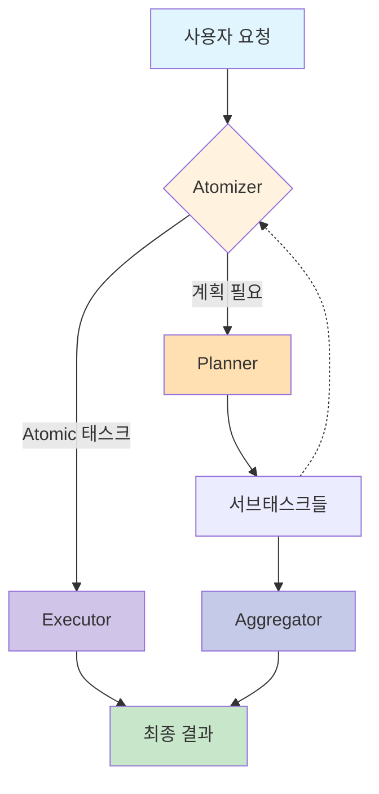

<div align="center">
    
    <h1>ROMA: Recursive Open Meta-Agents (한국어)</h1>
</div>

<p align="center">
  <strong>계층형 고성능 멀티 에이전트 시스템을 쉽게 구축하세요! (베타) </strong>
</p>

<p align="center">
<a href="https://trendshift.io/repositories/14848" target="_blank"></a>
</p>

<p align="center">
  <a href="https://sentient.xyz/" target="_blank" style="margin: 2px;">
    
  </a>
  <a href="https://github.com/sentient-agi" target="_blank" style="margin: 2px;">
    
  </a>
  <a href="https://huggingface.co/Sentientagi" target="_blank" style="margin: 2px;">
    
  </a>
</div>

<div align="center" style="line-height: 1;">
  <a href="https://discord.gg/sentientfoundation" target="_blank" style="margin: 2px;">
    
  </a>
  <a href="https://x.com/SentientAGI" target="_blank" style="margin: 2px;">
    
  </a>
</p>
<p align="center">
  <a href="https://www.sentient.xyz/blog/recursive-open-meta-agent">기술 블로그</a> •
  <a href="docs/">논문 (곧 공개 예정)</a> •
  <a href="https://www.sentient.xyz/">Build Agents for $$$</a>
</p>

</div>

## 📑 목차
- [🧠 개요 & 개념](#-개요--개념)
- [📦 설치 및 설정](#-설치-및-설정)
- [⚡ 퀵스타트: End-to-End 워크플로우](#-퀵스타트-end-to-end-워크플로우)
- [⚙️ 설정(Configuration) 및 저장소](#-설정configuration-및-저장소)
- [🧰 툴킷 (Toolkits)](#-툴킷-toolkits)
- [🌐 REST API & CLI](#-rest-api--cli)
- [🏗️ 핵심 빌딩 블록: `BaseModule`](#-핵심-빌딩-블록-basemodule)
- [📚 모듈 레퍼런스](#-모듈-레퍼런스)
  - [⚛️ 아토마이저 (Atomizer)](#-아토마이저-atomizer)
  - [📋 플래너 (Planner)](#-플래너-planner)
  - [⚙️ 실행기 (Executor)](#-실행기-executor)
  - [🔀 집계기 (Aggregator)](#-집계기-aggregator)
  - [✅ 검증기 (Verifier)](#-검증기-verifier)
- [🎯 고급 패턴](#-고급-패턴)
- [🧪 테스트](#-테스트)
- [💡 트러블슈팅 & 팁](#-트러블슈팅--팁)
- [📖 용어 사전](#-용어-사전)

---

## 🎯 ROMA란 무엇인가요?

<div align="center">
    
</div>
<br>

**ROMA**는 복잡한 문제를 해결하기 위해 재귀적 계층 구조를 사용하는 **메타 에이전트 프레임워크**입니다. ROMA는 작업을 병렬화 가능한 구성 요소로 분해함으로써, 에이전트가 정교한 추론 과제를 해결할 수 있게 합니다.

ROMA는 다음과 같은 특징을 제공합니다:
*   **병렬 문제 해결:** 에이전트들이 복잡한 작업의 서로 다른 부분을 동시에 처리합니다.
*   **투명한 개발:** 명확한 구조를 통해 디버깅과 컨텍스트 엔지니어링이 쉽습니다.
*   **검증된 성능:** 저희 검색 에이전트(Search Agent) 벤치마크를 통해 강력한 성능이 입증되었습니다.

또한, **오픈 소스이자 확장 가능한(Extensible)** 플랫폼으로서, 커뮤니티 주도의 개발을 지향합니다. 여러분의 필요에 맞는 에이전트를 직접 구축하고 커스터마이징할 수 있습니다.

## 🏗️ 작동 원리

**ROMA** 프레임워크는 재귀적인 **계획-실행(plan-execute) 루프**를 통해 작업을 처리합니다:

```python
def solve(task):
    if is_atomic(task):                 # 1단계: Atomizer (원자성 판단)
        return execute(task)            # 2단계: Executor (실행)
    else:
        subtasks = plan(task)           # 2단계: Planner (계획 수립)
        results = []
        for subtask in subtasks:
            results.append(solve(subtask))  # 재귀 호출 (Recursive call)
        return aggregate(results)       # 3단계: Aggregator (결과 취합)

# 진입점:
answer = solve(initial_request)
```

1.  **Atomizer (아토마이저)** – 요청이 **Atomic(더 이상 쪼갤 수 없는 단위)**이라서 바로 실행 가능한지, 아니면 **Planning(계획)**이 필요한지 결정합니다.
2.  **Planner (플래너)** – 계획이 필요하다면, 작업을 더 작은 **서브태스크(Subtasks)**로 쪼갭니다. 각 서브태스크는 다시 **Atomizer**로 전달되어 재귀적으로 처리됩니다.
3.  **Executors (실행기)** – Atomic 태스크를 처리합니다. LLM, API, 또는 다른 에이전트일 수도 있습니다 (`agent.execute()` 인터페이스만 구현하면 됩니다).
4.  **Aggregator (집계기)** – 서브태스크의 결과들을 모아서 최종 답변을 생성합니다. 단순 취합이 아니라, **부모 태스크에 대한 해답**으로 통합(Synthesize)합니다.

#### 📐 정보의 흐름
-   **Top-down:** 작업은 하위 작업으로 재귀적으로 분해됩니다.
-   **Bottom-up:** 하위 작업의 결과는 상위 작업의 솔루션으로 집계됩니다.
-   **Left-to-right:** 이전 작업의 결과에 의존하는 하위 작업은 해당 작업이 완료될 때까지 대기합니다.

이러한 구조 덕분에 시스템은 유연하고, 재귀적이며, 의존성을 인식할 수 있습니다. 복잡한 문제를 작은 단계로 나누면서도 결과의 일관성을 유지할 수 있습니다.

<details>
<summary>시스템 흐름도 보기 (클릭)</summary>



</details><br>

## 🚀 퀵스타트 (Quick Start)

### 가장 빠른 방법: 최소 설치 (평가용으로 추천)

인프라 설정 없이 **30초 안에** 시작할 수 있습니다:

```bash
# uv로 설치 (10-100배 빠름, 추천)
uv pip install roma-dspy

# 또는 pip로 설치
pip install roma-dspy

# OpenRouter API 키 설정 (기본값: Claude Sonnet 4.5 + Gemini 2.5 Flash)
export OPENROUTER_API_KEY="sk-or-v1-..."

# 즉시 문제 해결 시작
python -c "from roma_dspy.core.engine.solve import solve; print(solve('What is 2+2?'))"
```

> **참고**: 기본 설정은 OpenRouter를 사용합니다. `openrouter/anthropic/claude-3.5-sonnet` (Executor) 및 `openrouter/google/gemini-2.5-flash` (기타 에이전트). `OPENAI_API_KEY`를 설정하고 config를 수정하여 OpenAI를 직접 사용할 수도 있습니다.

**제공되는 기능:**
- ✅ 핵심 에이전트 프레임워크 (Atomizer, Planner, Executor, Aggregator, Verifier)
- ✅ 모든 DSPy 예측 전략 (CoT, ReAct, CodeAct 등)
- ✅ 파일 기반 저장소 (데이터베이스 불필요)
- ✅ 내장 툴킷 (계산기, 파일 조작)
- ✅ 모든 LLM 제공업체 지원 (OpenRouter, OpenAI, Anthropic 등)

**도커도, 데이터베이스도 필요 없습니다. 그냥 설치하고 실행하세요!**

### 프로덕션 설정: 도커를 활용한 전체 기능

영구 저장소(Persistence), 관측성(Observability), API 서버가 필요한 프로덕션 환경용입니다:

```bash
# 한 줄로 설치 (도커 빌드 및 서비스 시작)
just setup

# 또는 특정 프로필로 설치
just setup crypto_agent

# 서비스 실행 확인
curl http://localhost:8000/health

# API를 통해 작업 해결
just solve "What is the capital of France?"
```

**도커 환경 추가 기능:**
- 📊 **PostgreSQL**: 실행 기록 및 체크포인트 저장
- 📈 **MLflow**: 실험 추적 및 시각화
- 🌐 **REST API**: FastAPI 서버 및 대화형 문서 제공
- 📦 **MinIO**: S3 호환 저장소
- 🔧 **E2B**: 코드 실행 샌드박스
- 🎨 **TUI**: 대화형 터미널 시각화

**사용 가능한 서비스:**
- 🚀 **REST API**: http://localhost:8000/docs
- 🗄️ **PostgreSQL**: 자동 영구 저장
- 📦 **MinIO**: http://localhost:9001
- 📊 **MLflow**: http://localhost:5000 (`docker-up-full` 필요)

자세한 내용은 [퀵스타트 가이드](docs/QUICKSTART.md) 및 [배포 가이드](docs/DEPLOYMENT.md)를 참고하세요.

---

## 📦 설치 및 설정

### 옵션 1: 최소 설치 (가장 빠름 - 평가용 추천)

**적합한 대상:** ROMA 평가, 개발, 테스트, 빠른 프로토타이핑

**30초 안에 설치:**

```bash
# uv 사용 (추천)
uv pip install roma-dspy

# 또는 pip 사용
pip install roma-dspy
```

**API 키 설정:**
```bash
export OPENROUTER_API_KEY="sk-or-v1-..."  # 추천
# 또는
export OPENAI_API_KEY="sk-..."
export ANTHROPIC_API_KEY="sk-ant-..."
```

**바로 사용하기:**
```python
from roma_dspy.core.engine.solve import solve

# 아무 작업이나 해결
result = solve("What is the capital of France?")
print(result)
```

### 옵션 2: 도커를 포함한 전체 설치 (프로덕션) / 옵션 3: 개발용 설치
(상세 내용은 영문 문서를 참고하거나 위의 퀵스타트 섹션을 봐주세요.)

---

## ⚡ 퀵스타트: End-to-End 워크플로우

다음 예제는 전형적인 오케스트레이션 루프를 보여줍니다. 서로 다른 3개의 제공업체(Provider)를 사용하여 각 모듈이 어떻게 다른 모델과 전략을 사용하는지 보여줍니다.

```python
import dspy
from roma_dspy import Aggregator, Atomizer, Executor, Planner, Verifier, SubTask
from roma_dspy.types import TaskType

# Executor가 사용할 수 있는 도구 (Optional)
def get_weather(city: str) -> str:
    """해당 도시의 날씨 정보를 반환합니다."""
    return f"The weather in {city} is sunny."

# Executor: Fireworks 모델 + ReAct 전략 사용
executor_lm = dspy.LM(
    "fireworks_ai/accounts/fireworks/models/kimi-k2-instruct-0905",
    temperature=0.7,
    cache=True,
)
executor = Executor(
    lm=executor_lm,
    prediction_strategy="react",
    tools=[get_weather],
    context_defaults={"track_usage": True},
)

# Atomizer: 계획 분기가 필요한지 결정
atomizer = Atomizer(
    lm=dspy.LM("openrouter/google/gemini-2.5-flash", temperature=0.6, cache=False),
    prediction_strategy="cot",
    context_defaults={"track_usage": True},
)

# Planner: 비원자적(Non-atomic) 목표를 실행 가능한 서브태스크로 생성
planner = Planner(
    lm=dspy.LM("openrouter/openai/gpt-4o-mini", temperature=0.85, cache=True),
    prediction_strategy="cot",
    context_defaults={"track_usage": True},
)

aggregator = Aggregator(
    lm=dspy.LM("openrouter/openai/gpt-4o-mini", temperature=0.65),
    prediction_strategy="cot",
)

verifier = Verifier(
    lm=dspy.LM("openrouter/openai/gpt-4o-mini", temperature=0.0),
)

def run_pipeline(goal: str) -> str:
    atomized = atomizer.forward(goal)
    if atomized.is_atomic or atomized.node_type.is_execute:
        execution = executor.forward(goal)
        candidate = execution.output
    else:
        plan = planner.forward(goal)
        results = []
        for idx, subtask in enumerate(plan.subtasks, start=1):
            execution = executor.forward(subtask.goal)
            results.append(
                SubTask(
                    goal=subtask.goal,
                    task_type=subtask.task_type,
                    dependencies=subtask.dependencies,
                )
            )
        aggregated = aggregator.forward(goal, results)
        candidate = aggregated.synthesized_result

    verdict = verifier.forward(goal, candidate)
    if verdict.verdict:
        return candidate
    return f"Verifier flagged the output: {verdict.feedback or 'no feedback returned'}"

print(run_pipeline("Plan a weekend in Barcelona and include a packing list."))
```

---

## ⚙️ 설정(Configuration) 및 저장소

ROMA-DSPy는 **OmegaConf**를 사용하여 **Pydantic** 검증이 포함된 계층형 구성을 사용하며, 완벽한 작업 격리를 위한 **실행 범위 저장소(execution-scoped storage)**를 제공합니다.

### 빠른 설정 예시

```python
from roma_dspy.config import load_config

# 프로필 로드 및 오버라이드
config = load_config(
    profile="crypto_agent",
    overrides=["agents.executor.llm.temperature=0.3"]
)
```

**사용 가능한 프로필**: `general`, `crypto_agent` (`just list-profiles`로 확인 가능)

더 자세한 내용은 [설정 가이드](docs/CONFIGURATION.md)를 참고하세요.

---

## 🧰 툴킷 (Toolkits)

ROMA-DSPy는 에이전트 기능을 확장하는 9가지 내장 툴킷을 포함합니다:

*   **Core**: FileToolkit, CalculatorToolkit, E2BToolkit (코드 실행)
*   **Crypto**: CoinGeckoToolkit, BinanceToolkit, DefiLlamaToolkit, ArkhamToolkit
*   **Search**: SerperToolkit (웹 검색)
*   **Universal**: MCPToolkit (모든 [MCP 서버](https://github.com/wong2/awesome-mcp-servers) 연결 가능)

---

## 🚀 기여하기 (Contributing)

ROMA는 커뮤니티의 기여를 환영합니다!
버그 리포트, 기능 제안, PR 모두 환영합니다.
개발 환경 설정에 대해서는 `Option 3: Development Installation`을 참고해주세요.
