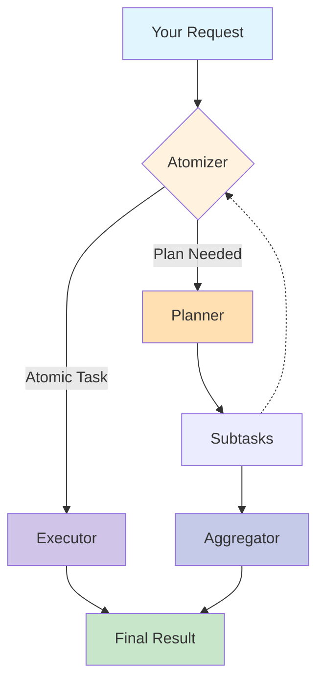

<div align="center">
    
    <h1>ROMA: 开源递归式元智能体 (Recursive Open Meta-Agents)</h1>
</div>

<p align="center">
  <strong>轻松构建分层高性能多智能体系统(Beta)</strong>
</p>

<p align="center">
<a href="https://trendshift.io/repositories/14848" target="_blank"></a>
</p>

<p align="center">
  <a href="https://sentient.xyz/" target="_blank" style="margin: 2px;">
    
  </a>
  <a href="https://github.com/sentient-agi" target="_blank" style="margin: 2px;">
    
  </a>
  <a href="https://huggingface.co/Sentientagi" target="_blank" style="margin: 2px;">
    
  </a>
</div>

<div align="center" style="line-height: 1;">
  <a href="https://discord.gg/sentientfoundation" target="_blank" style="margin: 2px;">
    
  </a>
  <a href="https://x.com/SentientAGI" target="_blank" style="margin: 2px;">
    
  </a>
</div>

<p align="center">
  <a href="https://www.sentient.xyz/blog/recursive-open-meta-agent">技术博客</a> •
  <a href="docs/">论文 (即将发布)</a> •
  <a href="https://www.sentient.xyz/builder-program">构建智能体赚取赏金</a>
</p>

---

## 📑 目录
- [🧠 概念概览](#-概念概览)
- [📦 安装与设置](#-安装与设置)
- [⚡ 快速入门：端到端工作流](#-快速入门端到端工作流)
- [⚙️ 配置与存储](#%EF%B8%8F-配置与存储)
- [🎨 Agent 定义与个性化](#-agent-定义与个性化)
- [🧰 工具箱](#-工具箱)
- [🌐 REST API 与 CLI](#-rest-api-与-cli)
- [🏗️ 核心构建块：`BaseModule`](#%EF%B8%8F-核心构建块basemodule)
- [📚 模块参考](#-模块参考)
  - [⚛️ Atomizer (原子化器)](#%E2%9A%9B%EF%B8%8F-atomizer-原子化器)
  - [📋 Planner (规划器)](#-planner-规划器)
  - [⚙️ Executor (执行器)](#%EF%B8%8F-executor-执行器)
  - [🔀 Aggregator (聚合器)](#-aggregator-聚合器)
  - [✅ Verifier (验证器)](#-verifier-验证器)
- [🎯 高级模式](#-高级模式)
- [🧪 测试](#-测试)
- [💡 故障排除与提示](#-故障排除与提示)
- [📖 术语表](#-术语表)
- [📊 基准测试 (Benchmarks)](#-基准测试-benchmarks)
- [🧩 基础与渊源](#-基础与渊源)
- [🙏 致谢](#-致谢)
- [📚 引用](#-引用)
- [🌟 Star 历史](#-star-历史)
- [📄 许可证](#-许可证)

---

## 🎯 ROMA 是什么？

<div align="center">
    
</div>
<br>

**ROMA (Recursive Open Meta-Agents)** 是一个**元智能体框架**，利用递归分层结构解决复杂问题。通过将任务分解为可并行的组件，ROMA 使智能体能够应对复杂的推理挑战，同时保持透明度，让上下文工程和迭代变得简单直观。该框架提供：
- **并行问题解决**：智能体同时处理复杂任务的不同部分。
- **透明开发**：清晰的结构便于调试。
- **经验证的性能**：我们的搜索智能体在基准测试中表现出色。

我们已经展示了框架的有效性，但这只是开始。作为**开源且可扩展**的平台，ROMA 专为社区驱动的开发而设计，允许您根据特定需求构建和定制智能体，同时从社区的集体改进中受益。

---

## 🏗️ 工作原理

**ROMA** 框架通过递归的 **计划-执行 (Plan-Execute)** 循环来处理任务：

```python
def solve(task):
    if is_atomic(task):                 # 步骤 1: Atomizer (原子化器)
        return execute(task)            # 步骤 2: Executor (执行器)
    else:
        subtasks = plan(task)           # 步骤 2: Planner (规划器)
        results = []
        for subtask in subtasks:
            results.append(solve(subtask))  # 递归调用
        return aggregate(results)       # 步骤 3: Aggregator (聚合器)

# 入口点:
answer = solve(initial_request)
```

1.  **Atomizer (原子化器)** – 决定请求是**原子的**（可直接执行）还是需要**规划**。
2.  **Planner (规划器)** – 如果需要规划，任务被分解为更小的**子任务**。每个子任务都会反馈给 Atomizer，使过程具有递归性。
3.  **Executors (执行器)** – 处理原子任务。执行器可以是 **LLM、API 甚至其他智能体** — 只要它们实现了 `agent.execute()` 接口。
4.  **Aggregator (聚合器)** – 收集并整合子任务的结果。重要的是，Aggregator 生成的是**原始父任务的答案**，而不仅仅是原始子输出的堆叠。

#### 📐 信息流
-   **自顶向下 (Top-down)**：任务递归分解为子任务。
-   **自底向上 (Bottom-up)**：子任务结果向上聚合成父任务的解决方案。
-   **从左到右 (Left-to-right)**：如果子任务依赖于前一个子任务的输出，它会等待该子任务完成后再执行。

这种结构使系统具有灵活性、递归性和依赖感知能力 — 能够将复杂问题分解为更小的步骤，同时确保结果连贯地整合在一起。

<details>
<summary>点击查看系统流程图</summary>



</details><br>

---

## 🚀 快速开始

### 最快方式：极简安装（推荐用于评估）

无需基础设施，**30秒内**即可开始：

```bash
# 使用 uv 安装 (推荐，速度快 10-100 倍)
uv pip install roma-dspy

# 或使用 pip
pip install roma-dspy

# 设置您的 API 密钥 (默认配置使用 OpenRouter)
export OPENROUTER_API_KEY="sk-or-v1-..."

# 立即开始解决任务
python -c "from roma_dspy.core.engine.solve import solve; print(solve('2+2 是多少？'))"
```

> **注意**：默认配置使用 OpenRouter 的 Claude Sonnet 4.5 (执行器) 和 Gemini 2.5 Flash (其他代理)。您也可以通过设置 `OPENAI_API_KEY` 并自定义配置来直接使用 OpenAI。

**您将获得：**
- ✅ 核心智能体框架 (Atomizer, Planner, Executor, Aggregator, Verifier)
- ✅ 所有 DSPy 预测策略 (CoT, ReAct, CodeAct 等)
- ✅ 文件存储 (无需数据库)
- ✅ 内置工具箱 (计算器, 文件操作)
- ✅ 支持任何 LLM 提供商 (OpenRouter, OpenAI, Anthropic 等)

**无 Docker，无数据库，无复杂设置 - 安装即用！**

### 生产设置：Docker 完整功能版

适用于具有持久化、可观察性和 API 服务器的生产环境：

```bash
# 一键设置 (构建 Docker, 启动服务)
just setup

# 或者使用特定配置文件
just setup crypto_agent

# 验证服务是否运行
curl http://localhost:8000/health

# 通过 API 解决任务
just solve "法国的首都是哪里？"
```

**Docker 版额外功能：**
- 📊 PostgreSQL 持久化 (执行历史, 检查点)
- 📈 MLflow 可观察性 (实验跟踪, 可视化)
- 🌐 REST API 服务器 (FastAPI 带交互式文档)
- 📦 S3 兼容存储 (MinIO)
- 🔧 E2B 代码执行沙箱
- 🎨 交互式 TUI 可视化

**可用服务：**
- 🚀 **REST API**: http://localhost:8000/docs
- 🗄️ **PostgreSQL**: 自动持久化
- 📦 **MinIO**: S3 兼容存储 (http://localhost:9001)
- 📊 **MLflow**: http://localhost:5000 (使用 `docker-up-full`)

详情请参阅 [快速入门指南](docs_zh/QUICKSTART.md) 和 [部署指南](docs_zh/DEPLOYMENT.md)。

---

## 🧠 概念概览

ROMA 的模块层将标准的 DSPy 模式封装为反映复杂任务执行生命周期的专用组件：

1.  **Atomizer (原子化器)**：决定请求是可以直接处理还是需要分解。
2.  **Planner (规划器)**：将非原子目标分解为有序的子任务图。
3.  **Executor (执行器)**：解决单个子任务，可选择通过函数/工具调用进行路由。
4.  **Aggregator (聚合器)**：将子任务输出合成为连贯的答案。
5.  **Verifier (验证器)** (可选)：在交付前根据原始目标检查聚合输出。

每个模块共享相同的人体工程学设计：使用语言模型 (LM) 或提供商字符串实例化它，选择预测策略，然后使用特定于任务的字段调用 `.forward()` (或 `.aforward()` 用于异步)。

所有模块最终都委托给 `roma_dspy.core.signatures` 中定义的 DSPy 签名。这使得即使内部结构演变，接口也能保持稳定。

---

## 📦 安装与设置

### 选项 1：极简安装 (最快 - 推荐用于评估)

**最适合**：评估 ROMA、开发、测试、快速原型设计

**30秒内安装：**

```bash
# 使用 uv (推荐 - 快 10-100 倍)
uv pip install roma-dspy

# 或使用 pip
pip install roma-dspy
```

**设置您的 API 密钥：**
```bash
export OPENROUTER_API_KEY="sk-or-v1-..."  # 推荐
# 或
export OPENAI_API_KEY="sk-..."
export ANTHROPIC_API_KEY="sk-ant-..."
```

**立即开始使用：**
```python
from roma_dspy.core.engine.solve import solve

# 解决任何任务
result = solve("法国的首都是哪里？")
print(result)
```

**包含内容：**
- ✅ 所有核心模块 (Atomizer, Planner, Executor, Aggregator, Verifier)
- ✅ 所有 DSPy 预测策略
- ✅ 基于文件的存储 (无需数据库)
- ✅ 核心工具箱 (计算器, 文件操作)
- ✅ 支持任何 LLM 提供商

**未包含内容 (如需请单独安装)：**
- PostgreSQL 持久化 → `uv pip install roma-dspy[persistence]`
- MLflow 可观察性 → `uv pip install roma-dspy[observability]`
- E2B 代码执行 → `uv pip install roma-dspy[e2b]`
- REST API 服务器 → `uv pip install roma-dspy[api]`
- S3 存储 → `uv pip install roma-dspy[s3]`
- 所有功能 → `uv pip install roma-dspy[all]`

---

### 选项 2：Docker 完整安装 (生产)

**最适合**：生产部署、团队协作、完整可观察性

**先决条件**：
- Docker & Docker Compose
- Python 3.12+ (用于本地开发)
- [Just](https://github.com/casey/just) 命令运行器 (可选，推荐)

**一键设置：**
```bash
# 交互式设置 (提示配置 E2B, S3 等)
just setup

# 或使用特定 profile
just setup crypto_agent
```

**手动 Docker 启动：**
```bash
just docker-up       # 基础 (PostgreSQL + MinIO + API)
just docker-up-full  # 包含 MLflow 可观察性
```

**环境变量** (由 `just setup` 自动配置)：
```bash
# LLM 提供商 (必需)
OPENROUTER_API_KEY=...     # 推荐
# 或
OPENAI_API_KEY=...
ANTHROPIC_API_KEY=...

# 可选：高级功能
E2B_API_KEY=...           # 代码执行
COINGECKO_API_KEY=...     # 加密工具箱
```

**Docker 额外功能：**
- 📊 PostgreSQL (执行历史, 检查点)
- 📈 MLflow (实验跟踪, 指标)
- 🌐 REST API (FastAPI 带文档)
- 📦 MinIO (S3 兼容存储)
- 🎨 TUI 可视化

---

### 选项 3：开发安装

**用于贡献或扩展 ROMA：**

```bash
# 克隆仓库
git clone https://github.com/sentient-agi/roma.git
cd roma

# 安装开发工具 (包含 pytest, ruff, mypy)
uv pip install -e ".[dev]"

# 运行测试
just test

# 格式化代码
just format

# 类型检查
just typecheck
```

---

### 对比：哪种安装适合您？

| 特性 | 极简 (`pip install roma-dspy`) | Docker (`just setup`) |
|------|-------------------------------|----------------------|
| 安装时间 | **< 30 秒** | ~5-10 分钟 |
| 基础设施需求 | **无** | Docker |
| 核心智能体框架 | ✅ | ✅ |
| 文件存储 | ✅ | ✅ |
| PostgreSQL 持久化 | ❌ (需安装 `[persistence]`) | ✅ |
| MLflow 可观察性 | ❌ (需安装 `[observability]`) | ✅ |
| REST API | ❌ (需安装 `[api]`) | ✅ |
| 适用场景 | 评估, 开发 | 生产, 团队 |

## ⚡ 快速入门：端到端工作流

以下示例展示了一个典型的编排循环。它使用三个不同的提供商来展示每个模块如何轻松地与不同的模型和策略配合工作。

```python
import dspy
from roma_dspy import Aggregator, Atomizer, Executor, Planner, Verifier, SubTask
from roma_dspy.types import TaskType

# 可选工具，供 Executor 调用
def get_weather(city: str) -> str:
    """返回城市的预设天气报告。"""
    return f"{city} 的天气是晴朗。"

# 针对 ReAct 策略的 Executor，使用 Fireworks 模型
executor_lm = dspy.LM(
    "fireworks_ai/accounts/fireworks/models/kimi-k2-instruct-0905",
    temperature=0.7,
    cache=True,
)
executor = Executor(
    lm=executor_lm,
    prediction_strategy="react",
    tools=[get_weather],
    context_defaults={"track_usage": True},
)

# Atomizer 决定何时进行规划分支
atomizer = Atomizer(
    lm=dspy.LM("openrouter/google/gemini-2.5-flash", temperature=0.6, cache=False),
    prediction_strategy="cot",
    context_defaults={"track_usage": True},
)

# Planner 为非原子目标生成可执行子任务
planner = Planner(
    lm=dspy.LM("openrouter/openai/gpt-4o-mini", temperature=0.85, cache=True),
    prediction_strategy="cot",
    context_defaults={"track_usage": True},
)

aggregator = Aggregator(
    lm=dspy.LM("openrouter/openai/gpt-4o-mini", temperature=0.65),
    prediction_strategy="cot",
)

verifier = Verifier(
    lm=dspy.LM("openrouter/openai/gpt-4o-mini", temperature=0.0),
)

def run_pipeline(goal: str) -> str:
    atomized = atomizer.forward(goal)
    if atomized.is_atomic or atomized.node_type.is_execute:
        execution = executor.forward(goal)
        candidate = execution.output
    else:
        plan = planner.forward(goal)
        results = []
        for idx, subtask in enumerate(plan.subtasks, start=1):
            execution = executor.forward(subtask.goal)
            results.append(
                SubTask(
                    goal=subtask.goal,
                    task_type=subtask.task_type,
                    dependencies=subtask.dependencies,
                )
            )
        aggregated = aggregator.forward(goal, results)
        candidate = aggregated.synthesized_result

    verdict = verifier.forward(goal, candidate)
    if verdict.verdict:
        return candidate
    return f"验证器标记了输出: {verdict.feedback or '无反馈返回'}"

print(run_pipeline("规划一个巴塞罗那周末游并包含打包清单。"))
```

亮点：
- 不同模块可以在不同的 LM 和温度上运行。
- 工具可以在构造时提供，也可以在每次调用时提供。
- `context_defaults` 确保每个 `.forward()` 调用都在正确的 `dspy.context()` 中使用模块的 LM。

---

## ⚙️ 配置与存储

ROMA-DSPy 使用 **OmegaConf** 进行分层配置，并结合 **Pydantic** 验证，提供**执行范围的存储**以实现完全的任务隔离。

### 快速配置示例

```python
from roma_dspy.config import load_config

# 加载 profile 并覆盖
config = load_config(
    profile="crypto_agent",
    overrides=["agents.executor.llm.temperature=0.3"]
)
```

**可用 Profiles**: `general`, `crypto_agent` (通过 `just list-profiles` 查看列表)

**参见**: [配置指南](docs_zh/CONFIGURATION.md) 获取关于 profiles、智能体配置、LLM 设置、工具箱配置和任务感知智能体映射的完整文档。

### 存储

存储是自动且基于执行范围的 - 每个任务都有一个隔离目录。大型工具箱响应 (>100KB) 自动存储为 Parquet 文件。

```python
from roma_dspy.core.engine.solve import solve

# 存储自动创建于: {base_path}/executions/{execution_id}/
result = solve("分析区块链交易")
```

**特性**: 执行隔离, S3 兼容, 自动 Parquet 存储, Docker 管理

**参见**: [部署指南](docs_zh/DEPLOYMENT.md) 了解包括 S3 集成在内的生产存储配置。

---

## 🎨 Agent 定义与个性化

在 ROMA 中，Agent 不再是硬编码的 Python 类，而是通过 **YAML 配置文件** 进行定义的“配置化实体”。这使得定制和扩展变得非常直观。

### 1. Agent 定义 = YAML 配置
您可以像搭积木一样，通过修改 `config/profiles/*.yaml` 文件来定义 Agent 的能力边界：
- **大脑 (LLM)**：指定模型（如用 Claude 3.5 Sonnet 处理复杂逻辑，用 Gemini Flash 处理大量文本）。
- **四肢 (Toolkits)**：挂载所需的工具箱（如搜索、代码执行、文件操作）。
- **性格 (Params)**：调整温度、最大 Token 数等参数。

### 2. 个性化 Sys Prompt (系统提示词)
ROMA 使用 DSPy 框架，将传统的大段 Sys Prompt 封装为更结构化的形式，称为 `signature_instructions`。它并没有消失，而是被更好地管理了。

您可以通过 YAML 灵活修改 Agent 的行为：

- **signature_instructions**：对应传统的 Sys Prompt。您可以直接在 YAML 中写字符串覆盖它，或指向一个 Python 文件中的变量（更推荐，便于复用）。
- **demos**：Few-Shot 示例。通过提供具体问答案例，引导 Agent 的输出风格和逻辑。

**示例：自定义一个“严谨的金融分析师”**

```yaml
agents:
  executor:
    # 1. 定义大脑 (使用强逻辑模型)
    llm:
      model: openrouter/anthropic/claude-3.5-sonnet
      temperature: 0.1 # 低温度以保持严谨

    # 2. 个性化 Prompt (覆盖默认指令)
    signature_instructions: "你是一名华尔街顶级分析师。回答必须基于数据，风格简练犀利，拒绝模棱两可的废话。"
    
    # 3. 挂载工具 (赋予专业能力)
    toolkits:
      - class_name: BinanceToolkit
        enabled: true
      - class_name: ArkhamToolkit
        enabled: true
```

---

## 🧰 工具箱 (Toolkits)

ROMA-DSPy 包含 9 个内置工具箱，扩展了智能体能力：

**核心**: FileToolkit, CalculatorToolkit, E2BToolkit (代码执行)
**加密**: CoinGeckoToolkit, BinanceToolkit, DefiLlamaToolkit, ArkhamToolkit
**搜索**: SerperToolkit (Web 搜索)
**通用**: MCPToolkit (连接到任何 [MCP 服务器](https://github.com/wong2/awesome-mcp-servers))

### 快速配置

```yaml
agents:
  executor:
    toolkits:
      - class_name: "FileToolkit"
        enabled: true
      - class_name: "E2BToolkit"
        enabled: true
        toolkit_config:
          timeout: 600
```

**参见**: [工具箱参考](docs_zh/TOOLKITS.md) 获取完整的工具箱文档，包括所有工具、配置选项、MCP 集成和自定义工具箱开发。

---

## 🌐 REST API 与 CLI

ROMA-DSPy 为生产使用提供 REST API 和 CLI。

### REST API

带交互式文档的 FastAPI 服务器：

```bash
# 随 Docker 自动启动
just docker-up

# API 文档: http://localhost:8000/docs
# 健康检查: http://localhost:8000/health
```

**端点**: 执行管理, 检查点, 可视化, 指标

### CLI

```bash
# 本地任务执行
roma-dspy solve "你的任务" --profile general

# 服务器管理
roma-dspy server start
roma-dspy server health

# 执行管理
roma-dspy exec create "Task"
roma-dspy exec status <id> --watch

# 交互式 TUI 可视化 (建议配合 MLflow)
just viz <execution_id>

# 完整帮助
roma-dspy --help
```

**参见**: `/docs` 端点处的 API 文档，获取完整的 OpenAPI 规范和交互式测试。

---

## 🏗️ 核心构建块：`BaseModule`

所有模块都继承自 `roma_dspy/core/modules/base_module.py` 中的 `BaseModule`。它标准化了：
- 通过 DSPy 预测策略进行的签名绑定，
- LM 实例化和上下文管理，
- 工具规范化和合并，
- 带安全关键字过滤的同步/异步入口点。

### 上下文与 LM 管理
实例化模块时，您可以提供现有的 `dspy.LM`，或者让模块通过提供商字符串 (`model`) 和可选关键字参数 (`model_config`) 构建一个。

```python
from roma_dspy import Executor

executor = Executor(
    model="openrouter/openai/gpt-4o-mini",
    model_config={"temperature": 0.5, "cache": True},
)
```

内部，`BaseModule` 确保每个 `.forward()` 调用都将预测器调用包装在：

```python
with dspy.context(lm=self._lm, **context_defaults):
    ...
```

您可以通过 `get_model_config()` 检查有效的 LM 配置，以确认提供商、缓存设置或经过清理的 kwargs。

### 使用工具
工具可以作为 DSPy 的 ReAct/CodeAct 策略接受的列表、元组或可调用对象映射提供。

```python
executor = Executor(tools=[get_weather])
executor.forward("安曼的天气怎么样？", tools=[another_function])
```

`BaseModule` 根据对象标识自动去重工具，并将构造函数默认值与每次调用的覆盖合并。

### 预测策略
ROMA 通过 `PredictionStrategy` 枚举 (`roma_dspy/types/prediction_strategy.py`) 暴露 DSPy 的策略。使用枚举或不区分大小写的字符串别名：

```python
from roma_dspy.types import PredictionStrategy

planner = Planner(prediction_strategy=PredictionStrategy.CHAIN_OF_THOUGHT)
executor = Executor(prediction_strategy="react")
```

可用选项包括 `Predict`, `ChainOfThought`, `ReAct`, `CodeAct`, `BestOfN`, `Refine`, `Parallel`, `majority` 等。需要工具的策略 (`ReAct`, `CodeAct`) 会自动接收传递给模块的任何工具。

### 异步执行
每个模块都提供 `aforward()` 方法。当底层 DSPy 预测器支持异步 (`acall`/`aforward`) 时，ROMA 会异步分发；否则，它会优雅地回退到同步实现，同时保持可等待性。

```python
result = await executor.aforward("下载最新的销售报告")
```

## 📚 模块参考

### ⚛️ Atomizer (原子化器)
**位置**: `roma_dspy/core/modules/atomizer.py`

**目的**: 决定目标是原子的还是需要规划。

**构造函数**:
```python
Atomizer(
    prediction_strategy: Union[PredictionStrategy, str] = "ChainOfThought",
    *,
    lm: Optional[dspy.LM] = None,
    model: Optional[str] = None,
    model_config: Optional[Mapping[str, Any]] = None,
    tools: Optional[Sequence|Mapping] = None,
    **strategy_kwargs,
)
```

**输入** (`AtomizerSignature`):
- `goal: str`

**输出** (`AtomizerResponse`):
- `is_atomic: bool` — 任务是否可以直接运行。
- `node_type: NodeType` — 下游路由的 `PLAN` 或 `EXECUTE` 提示。

**用法**:
```python
atomized = atomizer.forward("策划一个包含餐厅预订的5天东京行程")
if atomized.is_atomic:
    ...  # 直接发送给 Executor
else:
    ...  # 转交给 Planner
```

Atomizer 与策略无关，但通常使用 `ChainOfThought` 或 `Predict`。您可以通过 `call_params` 传递提示 (例如 `max_tokens`):

```python
atomizer.forward(
    "总结这份 PDF",
    call_params={"max_tokens": 200},
)
```

### 📋 Planner (规划器)
**位置**: `roma_dspy/core/modules/planner.py`

**目的**: 将目标分解为带有可选依赖图的有序子任务。

**构造函数**: 与 Atomizer 相同的模式。

**输入** (`PlannerSignature`):
- `goal: str`

**输出** (`PlannerResult`):
- `subtasks: List[SubTask]` — 每个包含 `goal`, `task_type`, 和 `dependencies`。
- `dependencies_graph: Optional[Dict[str, List[str]]]` — LM 返回时的显式邻接映射。

**用法**:
```python
plan = planner.forward("在6周内启动一个 B2B 网络研讨会")
for subtask in plan.subtasks:
    print(subtask.goal, subtask.task_type)
```

`SubTask.task_type` 是一个 `TaskType` 枚举，遵循 ROMA MECE 框架 (Retrieve, Write, Think, Code Interpret, Image Generation)。

### ⚙️ Executor (执行器)
**位置**: `roma_dspy/core/modules/executor.py`

**目的**: 解决原子目标，可选地通过 DSPy 的 ReAct, CodeAct 或类似策略调用工具/函数。

**构造函数**: 相同模式；最常用的策略是 `ReAct`, `CodeAct`, 或 `ChainOfThought`。

**输入** (`ExecutorSignature`):
- `goal: str`

**输出** (`ExecutorResult`):
- `output: str | Any`
- `sources: Optional[List[str]]` — 来源或引用。

**用法**:
```python
execution = executor.forward(
    "编制一个为期3天的滑雪旅行打包清单",
    config={"temperature": 0.4},  # 每次调用的 LM 覆盖
)
print(execution.output)
```

仅为某些调用暴露工具：

```python
execution = executor.forward(
    "巴黎的天气怎么样？",
    tools=[get_weather],
)
```

### 🔀 Aggregator (聚合器)
**位置**: `roma_dspy/core/modules/aggregator.py`

**目的**: 将多个子任务结果组合成最终的叙述或决策。

**构造函数**: 相同模式。

**输入** (`AggregatorResult` signature):
- `original_goal: str`
- `subtasks_results: List[SubTask]` — 通常是 planner 的建议加上执行输出。

**输出** (`AggregatorResult` base model):
- `synthesized_result: str`

**用法**:
```python
aggregated = aggregator.forward(
    original_goal="规划数据迁移",
    subtasks_results=[
        SubTask(goal="清点当前数据库", task_type=TaskType.RETRIEVE),
        SubTask(goal="起草迁移时间表", task_type=TaskType.WRITE),
    ],
)
print(aggregated.synthesized_result)
```

因为它继承自 `BaseModule`，如果您的聚合策略需要外部调用，您仍然可以附加工具（例如，知识库检索函数）。

### ✅ Verifier (验证器)
**位置**: `roma_dspy/core/modules/verifier.py`

**目的**: 验证合成后的输出是否满足原始目标。

**输入** (`VerifierSignature`):
- `goal: str`
- `candidate_output: str`

**输出**:
- `verdict: bool`
- `feedback: Optional[str]`

**用法**:
```python
verdict = verifier.forward(
    goal="起草一份符合 GDPR 的隐私政策",
    candidate_output=aggregated.synthesized_result,
)
if not verdict.verdict:
    print("需要修改:", verdict.feedback)
```

## 🎯 高级模式

### 运行时交换模型
使用 `replace_lm()` 为同一模块重用不同的 LM（用于 A/B 测试或回退）。

```python
fast_executor = executor.replace_lm(dspy.LM("openrouter/anthropic/claude-3-haiku"))
```

### 每次调用覆盖
您可以在不重建模块的情况下改变 LM 行为或提供额外参数。

```python
executor.forward(
    "总结会议记录",
    config={"temperature": 0.1, "max_tokens": 300},
    context={"stop": ["Observation:"]},
)
```

`call_params` (或关键字参数) 会被过滤以匹配 DSPy 预测器接受的 kwargs，防止意外错误。

### 仅工具执行
如果您想要确定性的工具路由，可以设置一个虚拟 LM（或极低温度的模型）并传递纯 Python 可调用对象。

```python
from roma_dspy import Executor

executor = Executor(
    prediction_strategy="code_act",
    lm=dspy.LM("openrouter/openai/gpt-4o-mini", temperature=0.0),
    tools={"get_weather": get_weather, "lookup_user": lookup_user},
)
```

ROMA 将确保构造函数和每次调用的工具都可供策略使用。

## 🧪 测试

```bash
# 运行所有测试
just test

# 运行特定测试
pytest tests/unit/ -v
pytest tests/integration/ -v
```

**参见**: `justfile` 获取所有可用的测试命令。

## 💡 故障排除与提示
- **`ValueError: Either provide an existing lm`** — 构造模块时提供 `lm=` 或 `model=`。
- **`Invalid prediction strategy`** — 检查拼写；字符串不区分大小写，但必须匹配已知别名。
- **缓存** — 在您的 LM 上传递 `cache=True` 或在 `model_config` 中设置，以重用以前的完成。
- **异步上下文** — 混合同步和异步调用时，确保您的事件循环正在运行（例如，使用 `asyncio.run`）。
- **工具重复** — 工具按标识去重；如果需要变体，请创建不同的函数。

## 📖 术语表

### 核心概念
- **DSPy**: 斯坦福的用于提示、规划和工具集成的声明式框架。
- **Prediction Strategy (预测策略)**: 驱动推理的 DSPy 类/函数 (CoT, ReAct 等)。
- **SubTask (子任务)**: 描述分解工作单元的 Pydantic 模型 (`goal`, `task_type`, `dependencies`)。
- **NodeType (节点类型)**: Atomizer 选定的是 `PLAN` 还是 `EXECUTE`。
- **TaskType (任务类型)**: 子任务的 MECE 分类 (`RETRIEVE`, `WRITE`, `THINK`, `CODE_INTERPRET`, `IMAGE_GENERATION`)。
- **Context Defaults (上下文默认值)**: 每次调用提供给 `dspy.context(...)` 的关键字参数。

### 配置与存储
- **FileStorage**: 提供每个任务执行隔离目录的执行范围存储管理器。
- **DataStorage**: 用于大型工具箱响应的自动 Parquet 存储系统（基于阈值）。
- **Execution ID**: 每个任务执行的唯一标识符，用于存储隔离。
- **Base Path**: 所有存储操作的根目录（本地路径或 S3 桶）。
- **Profile**: 命名配置预设（例如 `general`, `crypto_agent`）。
- **Configuration Override**: 运行时值，覆盖 profile/默认设置。

### 工具箱
- **BaseToolkit**: 所有工具箱的抽象基类，提供存储集成和工具注册。
- **REQUIRES_FILE_STORAGE**: 元数据标志，指示工具箱需要 FileStorage（例如 FileToolkit）。
- **Toolkit Config**: 工具箱特定设置，如 API 密钥、超时和阈值。
- **Tool Selection**: 包含/排除列表，用于过滤工具箱中可用的工具。
- **Storage Threshold**: 大小限制 (KB)，超过此限制响应将以 Parquet 格式存储。

### 架构
- **Execution-Scoped Isolation**: 每个执行获得唯一存储目录的模式。
- **Parquet Integration**: 大型结构化数据的自动列式存储。
- **S3 Compatibility**: 通过 Docker 卷挂载使用 S3 兼容存储的能力。
- **Tool Registration**: 自动发现并注册工具箱方法为可调用工具。

---

Happy building! 如果您扩展或自定义模块，请保持签名对齐，以便更高级别的编排保持稳定。

**额外资源:**
- [快速入门指南](docs_zh/QUICKSTART.md) - 10分钟内上手
- [配置指南](docs_zh/CONFIGURATION.md) - 完整的配置参考
- [工具箱参考](docs_zh/TOOLKITS.md) - 所有内置及自定义工具箱
- [部署指南](docs_zh/DEPLOYMENT.md) - 使用 Docker 进行生产部署
- [E2B 设置](docs_zh/E2B_SETUP.md) - 代码执行工具箱设置
- [可观察性](docs_zh/OBSERVABILITY.md) - MLflow 跟踪与监控
- [配置系统](config/README.md) - 配置 profiles 和示例

## 📊 基准测试 (Benchmarks)

我们使用 ROMA 的一个简单搜索系统实现（称为 ROMA-Search）在三个基准测试中进行了评估：**SEAL-0**、**FRAMES** 和 **SimpleQA**。
以下是每个基准测试的性能图表。

### [SEAL-0](https://huggingface.co/datasets/vtllms/sealqa)
SealQA 是一个新的具有挑战性的基准测试，用于在网络搜索产生冲突、嘈杂或无益结果时，评估搜索增强语言模型在事实寻求问题上的表现。


---

### [FRAMES](https://huggingface.co/datasets/google/frames-benchmark)
<details>
<summary>查看完整结果</summary>

一个全面的评估数据集，旨在测试检索增强生成 (RAG) 系统在事实性、检索准确性和推理方面的能力。


</details>

---

### [SimpleQA](https://openai.com/index/introducing-simpleqa/)
<details>
<summary>查看完整结果</summary>

衡量语言模型回答简短事实性问题能力的事实性基准测试。


</details>

## 🧩 基础与渊源

虽然 ROMA 引入了一个用于分层任务执行的实用开源框架，但它直接建立在 [WriteHERE](https://arxiv.org/abs/2503.08275) 中引入的两个基础研究贡献之上：

- **异构递归规划 (Heterogeneous Recursive Planning)** — ROMA 的整体架构遵循先前关于*异构递归规划*工作中引入的框架，其中复杂任务被递归分解为子任务图，每个子任务分配一个独特的认知类型。

- **分解中的类型规范 (Type Specification in Decomposition)** — ROMA 的“三个通用操作”（思考 THINK 🤔、写作 WRITE ✍️、搜索 SEARCH 🔍）概括了*分解中的类型规范*假设，该假设将推理、组合和检索确定为三种基本的认知类型。

这些贡献在 WriteHERE 仓库和论文中有详细描述。通过明确采用和扩展这一基础，ROMA 提供了一个**可通用的脚手架、智能体系统、多功能性和可扩展性**，建立在这些见解之上，并使各个领域的构建者可以使用它们。

## 🙏 致谢

如果没有这些令人惊叹的开源贡献，这个框架是不可能实现的！
- 灵感来自 Xiong 等人在 ["Beyond Outlining: Heterogeneous Recursive Planning"](https://arxiv.org/abs/2503.08275) 中描述的分层规划方法。
- [Pydantic](https://github.com/pydantic/pydantic) - 使用 Python 类型注释的数据验证
- [DSPy]([https://dspy.ai/)) - 编程 AI 智能体的框架
- [E2B](https://github.com/e2b-dev/e2b) - AI 智能体的云运行时

## 📚 引用

如果您在研究中使用了 ROMA 仓库，请引用：

```bibtex
@software{al_zubi_2025_17052592,
  author       = {Al-Zubi, Salah and
                  Nama, Baran and
                  Kaz, Arda and
                  Oh, Sewoong},
  title        = {SentientResearchAgent: A Hierarchical AI Agent
                   Framework for Research and Analysis
                  },
  month        = sep,
  year         = 2025,
  publisher    = {Zenodo},
  version      = {ROMA},
  doi          = {10.5281/zenodo.17052592},
  url          = {https://doi.org/10.5281/zenodo.17052592},
  swhid        = {swh:1:dir:69cd1552103e0333dd0c39fc4f53cb03196017ce
                   ;origin=https://doi.org/10.5281/zenodo.17052591;vi
                   sit=swh:1:snp:f50bf99634f9876adb80c027361aec9dff97
                   3433;anchor=swh:1:rel:afa7caa843ce1279f5b4b29b5d3d
                   5e3fe85edc95;path=salzubi401-ROMA-b31c382
                  },
}
```

## 🌟 Star History

<div align="center">

[](https://www.star-history.com/#sentient-agi/roma&Date)

</div>

## 📄 许可证

本项目采用 Apache 2.0 许可证 - 详情请参阅 [LICENSE](LICENSE) 文件。
